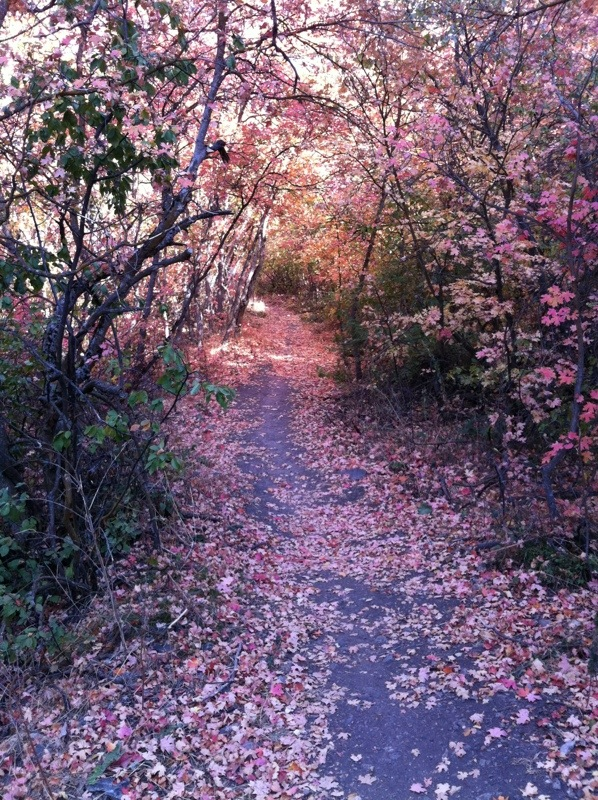
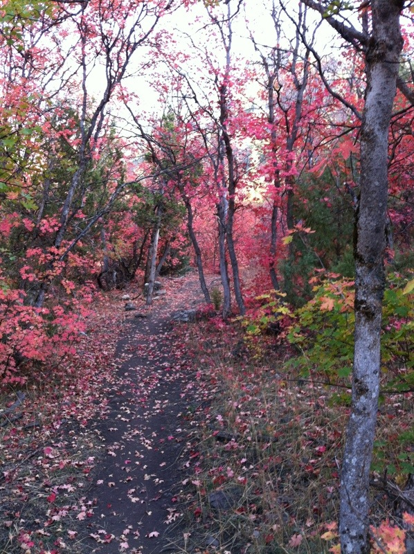
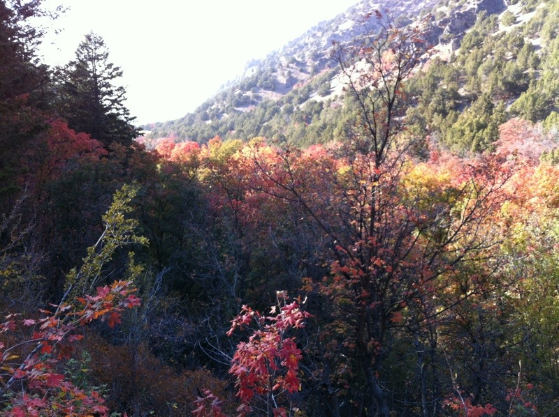
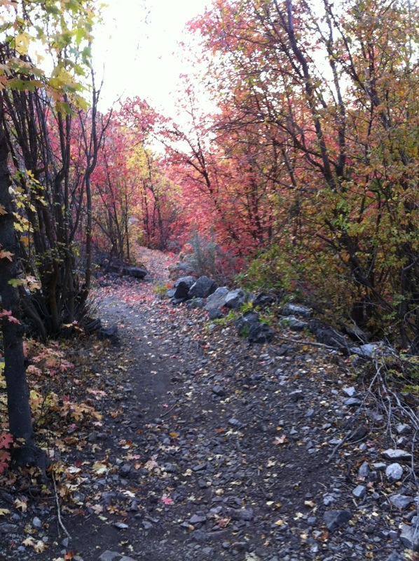
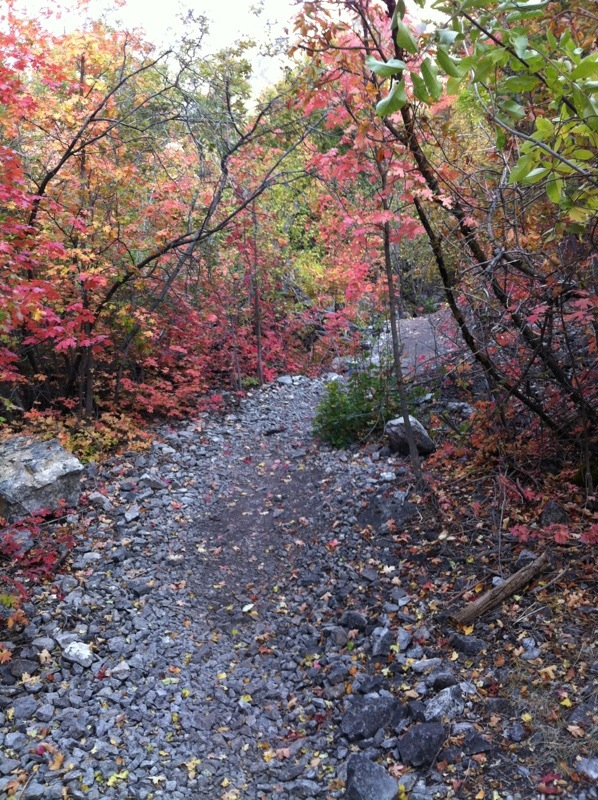
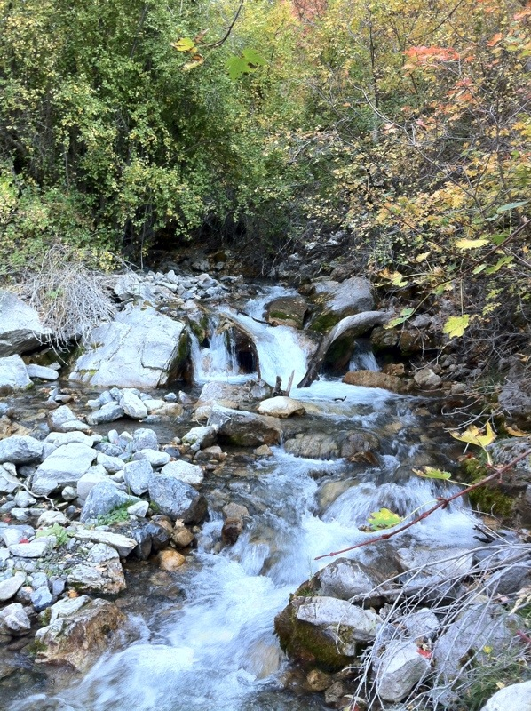
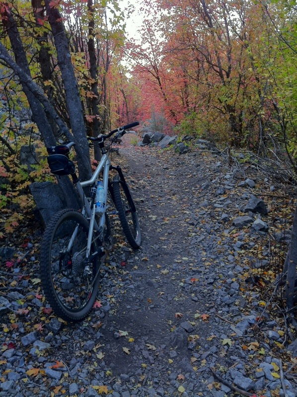
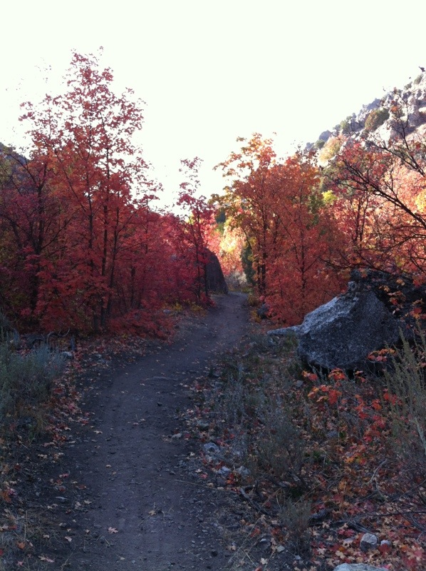
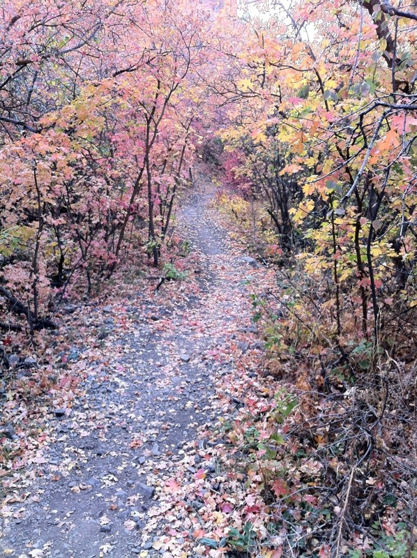
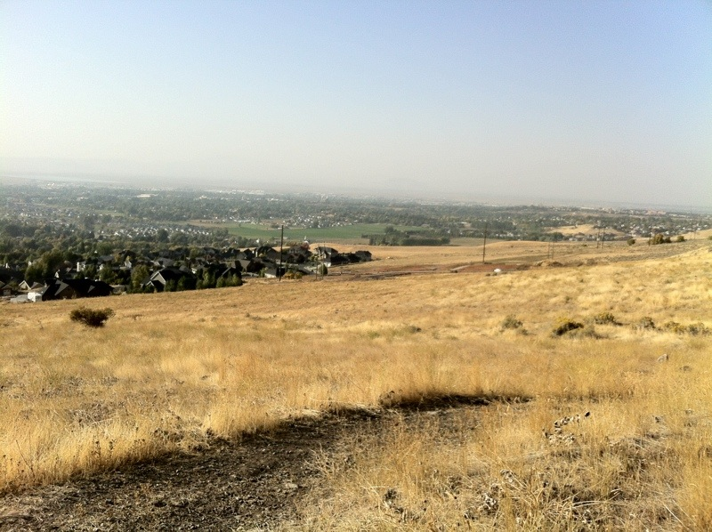

More pictures from yesterday. This time from Providence Canyon and the Bonneville Shoreline Trail. The Forest Service is putting in a new road which means the top section of the trail was bulldozed. Still it makes for a great ride.

  

    
  

  

    
  

  

    
  

  

    
  

  

    
  

  

    
  

  

    
  

  

    
  

  

    
  

  

    
  

The last image is a a view of Cache Valley from the Bonneville Shoreline trail. The haze moves in with the cold air. I'll be really happy when all the fires are out all over the west.
