After a week with the Google tech elite today was a day dedicated to fun, curiosity and fascination. Callie brought Devin down Yesterday so we could spend today experiencing the inventions of the Bay Area's eccentric, creative, technology minds.

I'm not sure how to describe Maker Faire. There are vendors selling everything from small CNC machines to youth groups with kits. There were more 3D printers than I could count including one about 20 feet tall that could print some truely monumental sculptures.

  <a href="giant_3D_printer.jpg">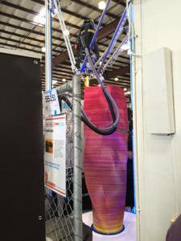</a>

There were classes on how to grow from mushrooms and a truck converted into a mobile green house. There were sculptures that spewed fire, a Tesla with panels that lit up like a zebra and a giant forest of lit up inflatable astro-flower things. It was pretty cool.

  <a href="justin_callie.jpg">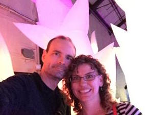</a>
  <a href="forest.jpg">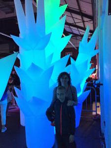</a>

There was a <a href="http://www.strandbeest.com/">StrandBeest</a> which is amazing to see in person:

<iframe width="560" height="315" src="https://www.youtube.com/embed/BHqZEfTWhOo" frameborder="0" allowFullScreen></iframe>

The R2D2 club was on hand to show off the droids we've all been looking for:

  <iframe width="560" height="315" src="https://www.youtube.com/embed/lIpLIfPUmWg" frameborder="0" allowFullScreen></iframe>

Speaking of droids here's the guts of a BB8 Sphero:

  <a href="Dalek.jpg">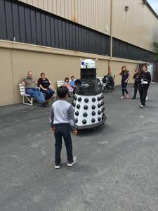</a>
  <a href="bb8_disassembled.jpg">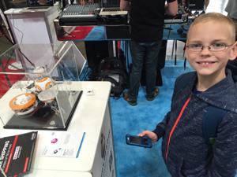</a>

How about a Lego machine that folds paper airplanes and then launches them? There's Devin standing in front a giant sculpture made of tape and a T-Rex made of cardboard covered in EL-Wire.

  <a href="lego_paper_airplane_builder.jpg">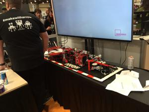</a>
  <a href="Devin_with_Tapigami.jpg">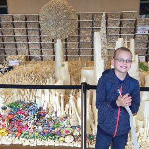</a>
  <a href="cardboard_t-rex.jpg">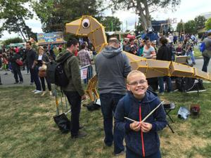</a>

Devin building an LED flashlight out of a popsicle stick, and LED and some conductive tape.

  <a href="LED_Flashlight.jpg">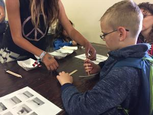</a>

Pancakes?

  <a href="pancake_printer.jpg">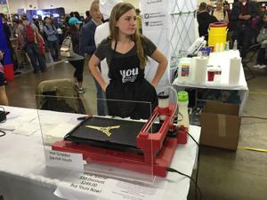</a>

Everyone needs a motorcycle that looks like a dragon:

  <a href="dragon_cycle.jpg">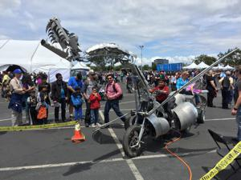</a>

EepyBird was on hand to cover the audience in Coke:

  <iframe width="560" height="315" src="https://www.youtube.com/embed/54-jSaVQABA" frameborder="0" allowFullScreen></iframe>

Oh and there was also free Haagen-Dazs ice cream. Any event with free ice cream is a bit of awesome.
