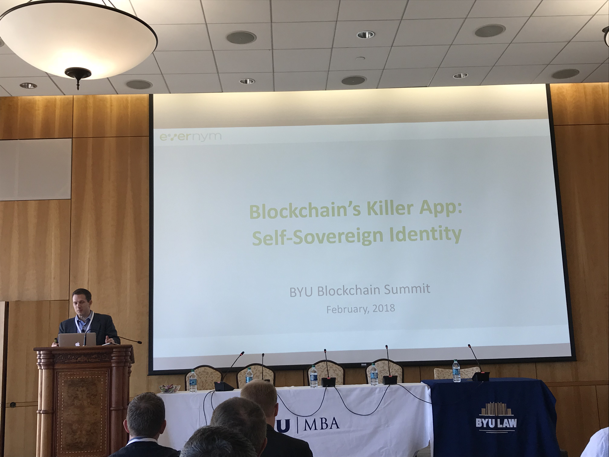
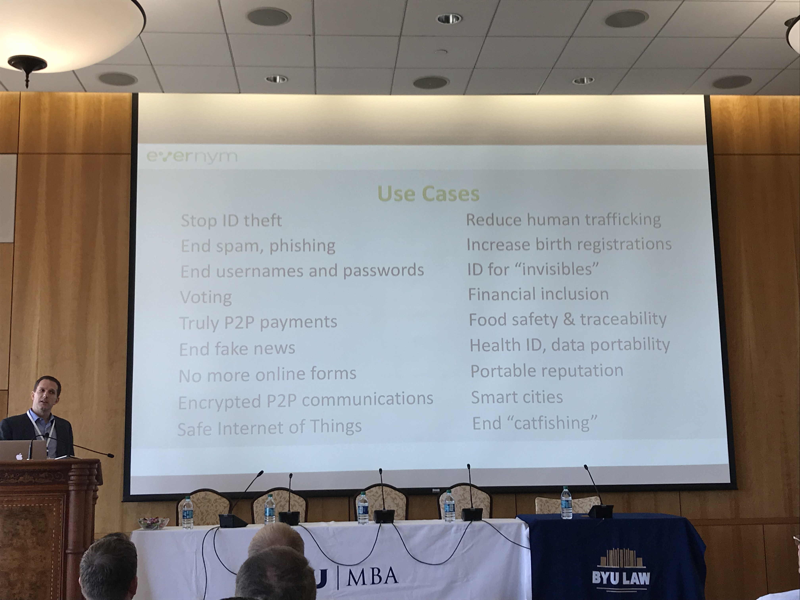

<h2><a href="https://www.evernym.com/Leadership/timothy-ruff/">Timothy Ruff</a> - Self Sovereign Identity</h2>

<h2>Blockchain use cases</h2>

Cost of fraud - $3.7 trillion. This includes the cost of fraud, the cleaning up of the mess, phishing attacks etc.

Current identity is siloed. Sometimes that's Facebook, sometimes that's government. In some parts of the world you aren't issued any identity which means you have no identity and makes transactions difficult.

<h3>Points from Timothy's presentation</h3>

2 billion people are unbanked. They have no acces to banks or proof of property ownership.

<a href="https://hackernoon.com/identity-without-authority-a-decentralized-id-system-for-the-whole-world-bf9aad1a096b">1.1 billion people can't prove their identity</a>.

95% of all attacks on enterprise networks are the result of successful spear phishing.

Timothy's company <a href="https://www.evernym.com">Evernym</a> pioneered <a href="https://github.com/WebOfTrustInfo/ID2020DesignWorkshop/blob/master/topics-and-advance-readings/DID-Whitepaper.md">Decentralized Identifiers</a> which is becoming a <a href="https://w3c-ccg.github.io/did-spec/">W3 standard</a>
.

Sovrin Public Distributed Ledger does not have any information other than public keys. Identity is established by an exchange of claims over an encrypted peer to peer connection.

Google sidewalk labs is going to use the Sovrin Ledger

Key pieces of the protocol - Discoverable with interoperable protocols with total privacy.

Some background:
<ul>
  <li><a href="https://medium.com/decentralized-identity/a-universal-resolver-for-self-sovereign-identifiers-48e6b4a5cc3c">A Universal Resolver for self-sovereign identifiers</a></li>
  <li><a href="https://medium.com/decentralized-identity/the-rising-tide-of-decentralized-identity-2e163e4ec663">The Rising Tide of Decentralized Identity</a></li>
</ul>
