
A few times each winter the weather cooperates, the trail is in perfect condition and I can spare a few hours for a super fun and super hard 6 miles. Winter is one of the most beautiful times to ride and Providence Canyon offers a peaceful, serene experience. Today was one of those days.

  

    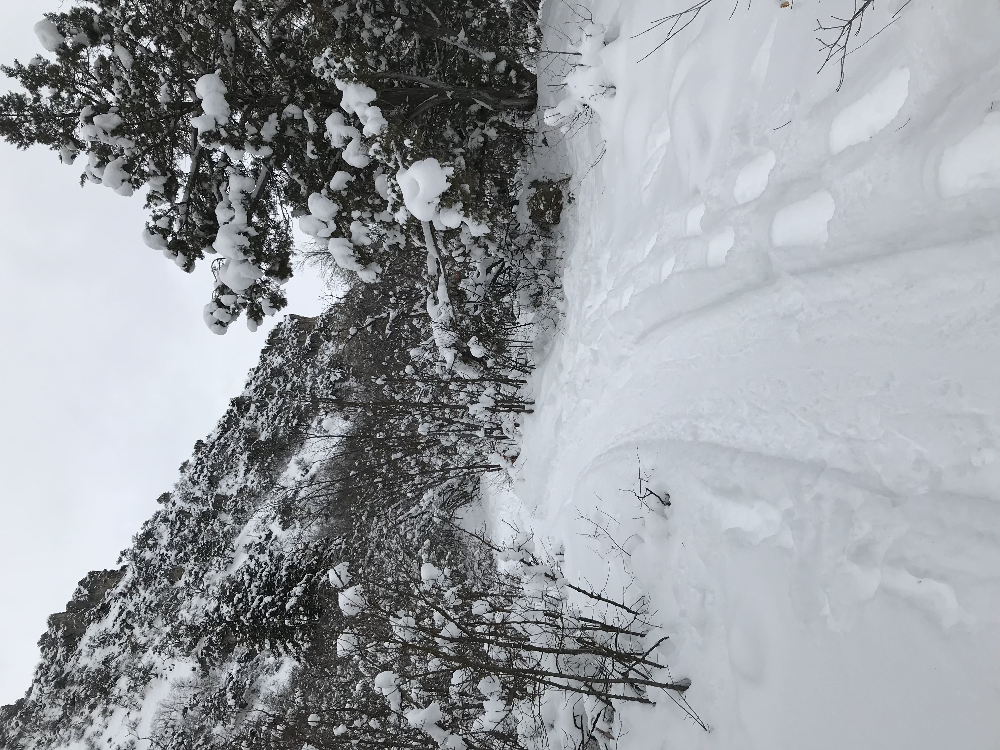
    
Perfectly packed trail.

  

  

    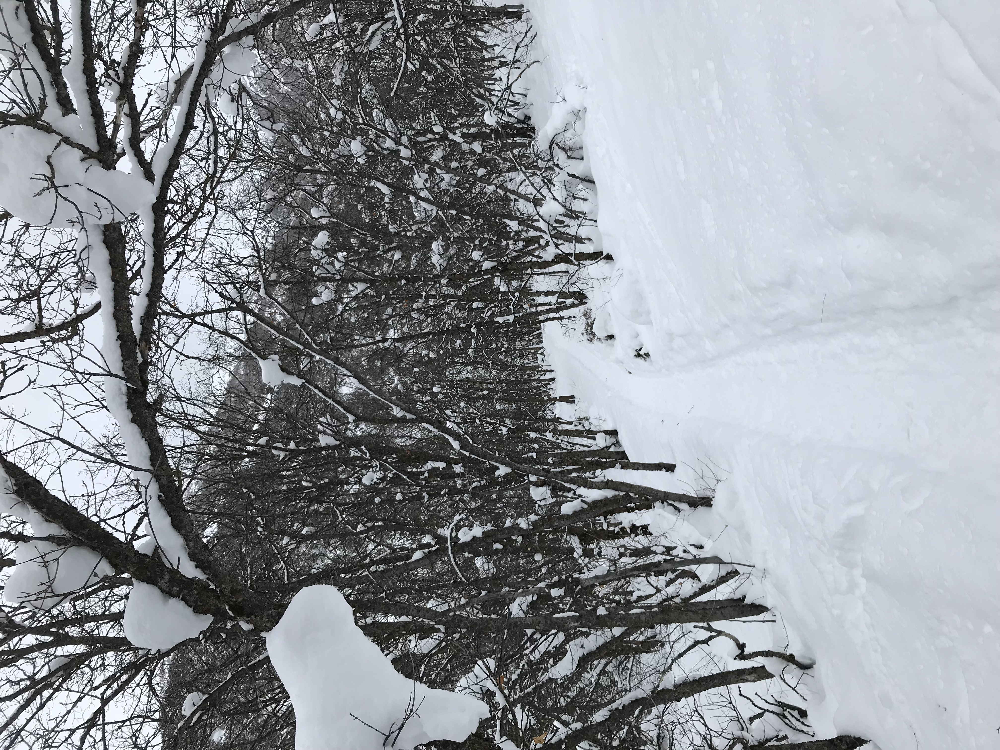
    
Into the woods

  

  

    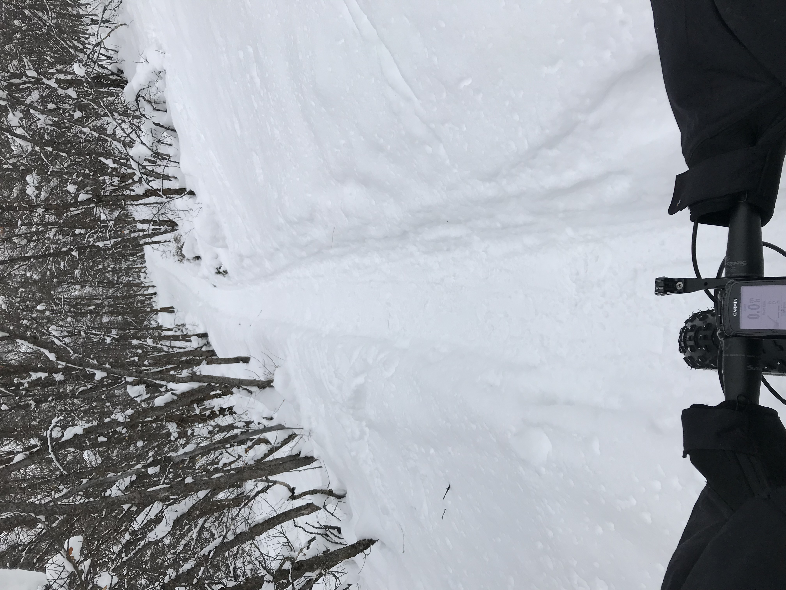
    
View from the cockpit

  

  

    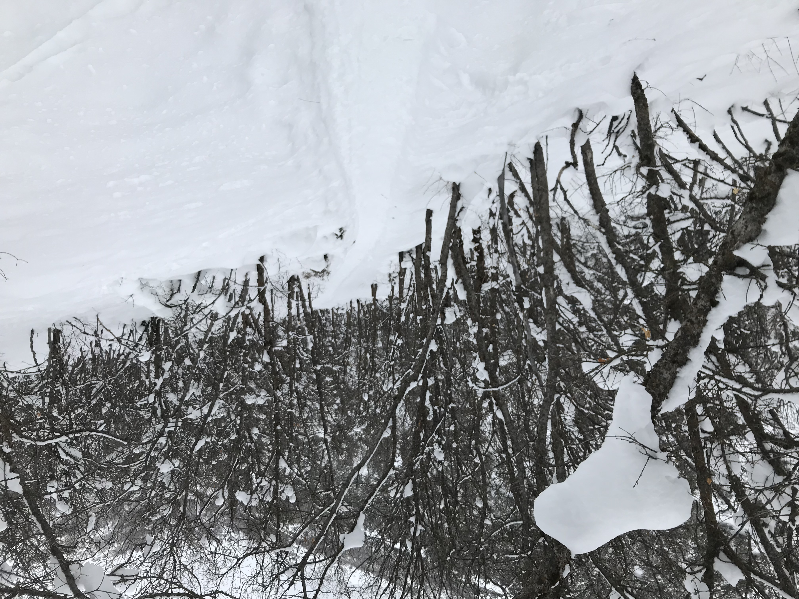
    
More trail

  

  

    
    
Bridge over the creek

  

  

    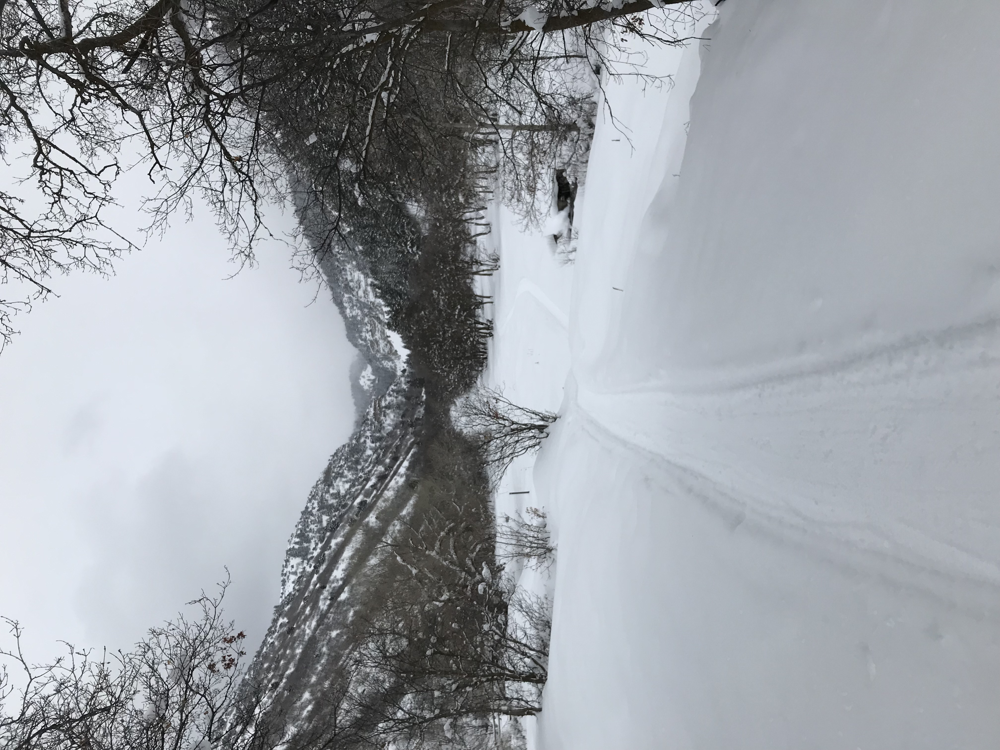
    
Open view towards the top of the canyon

  

  

    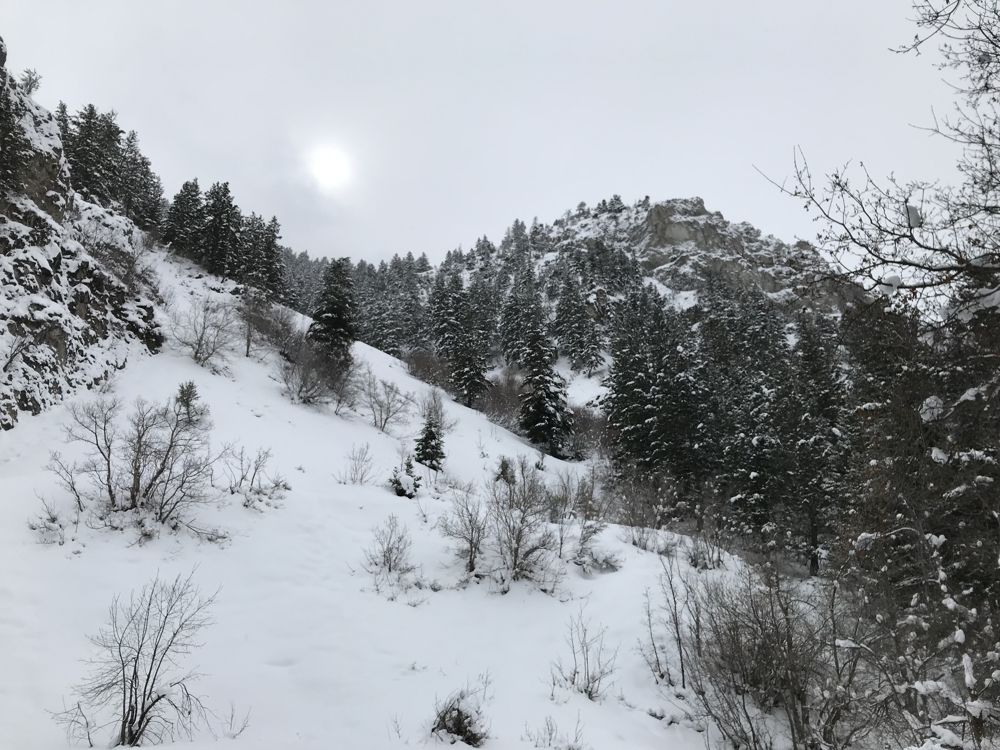
    
The sun over the top of the canyon

  

  

    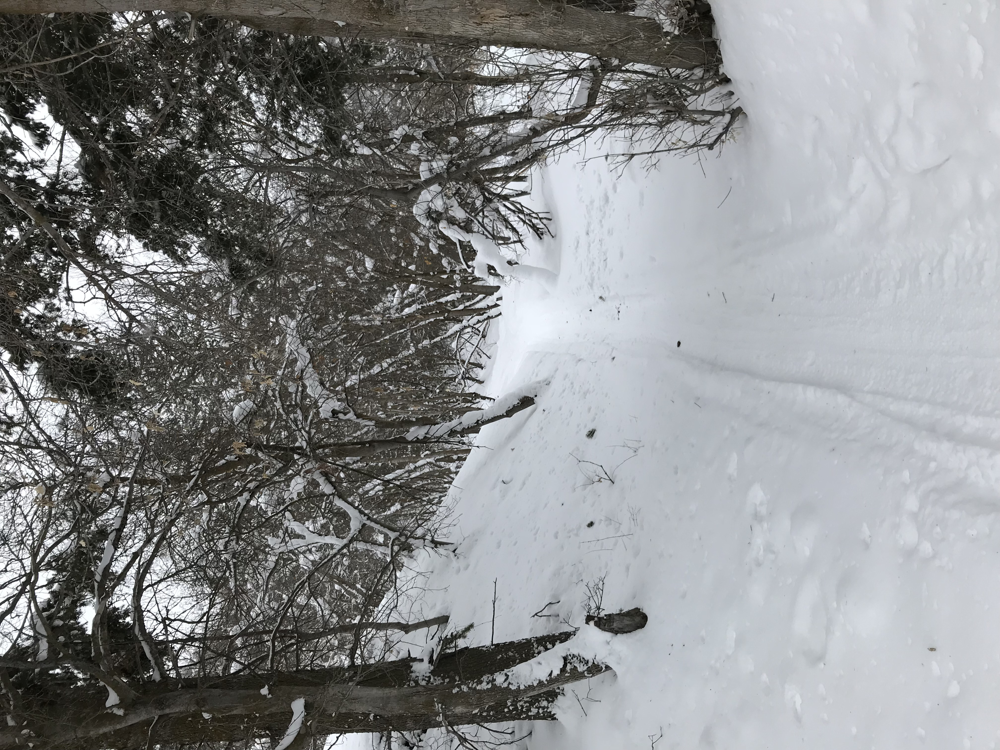
    
View from the top looking down

  

  

    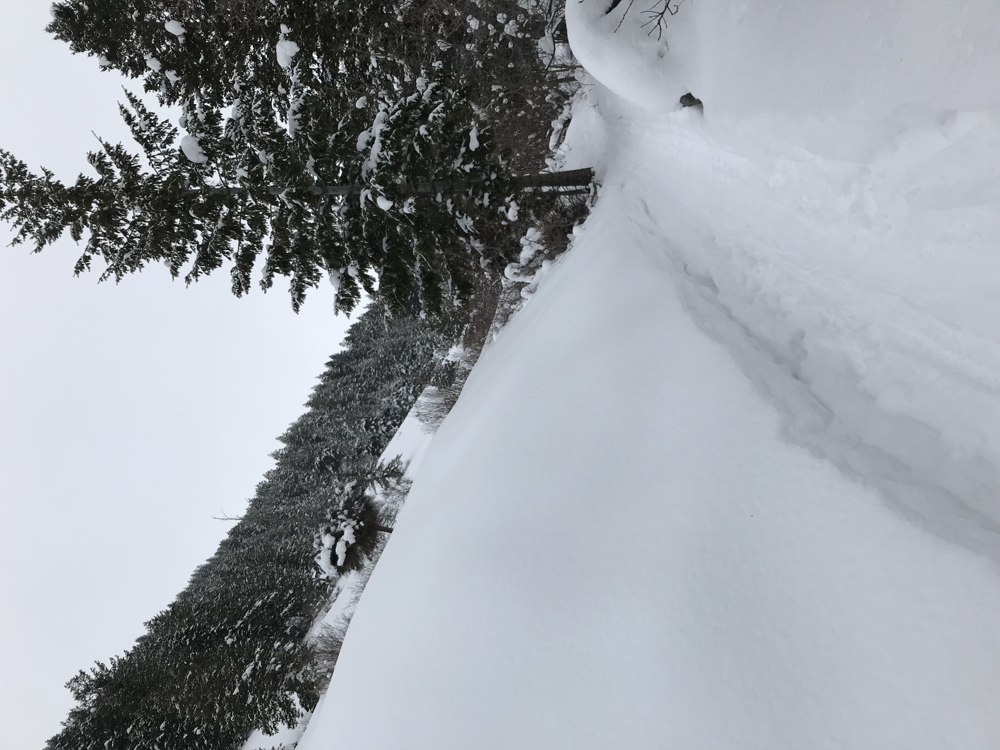
    
Cut through the snow

  

  

    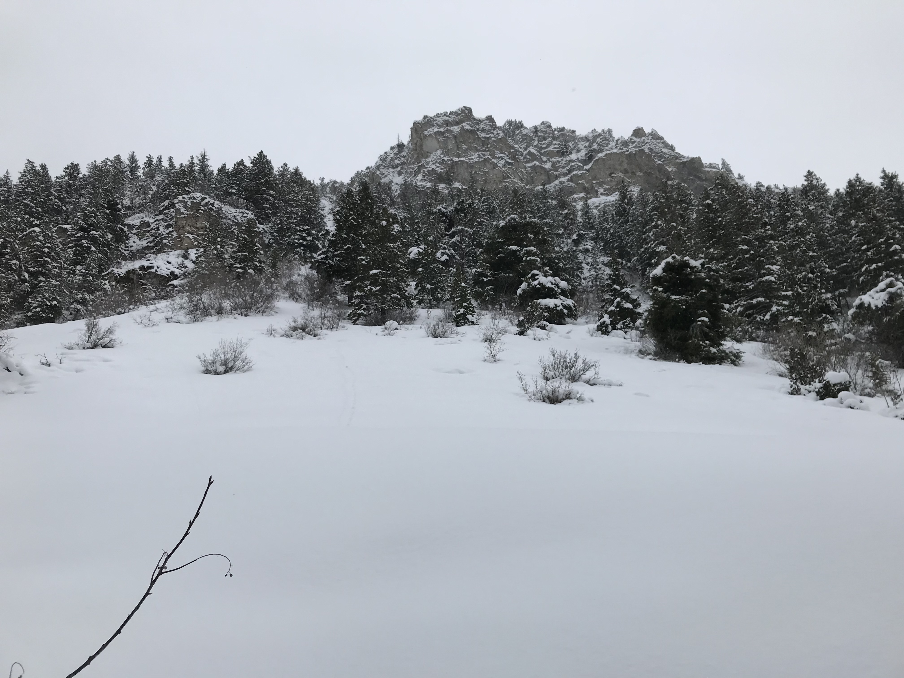
    
Looking up at the top of the canyon

  

  

    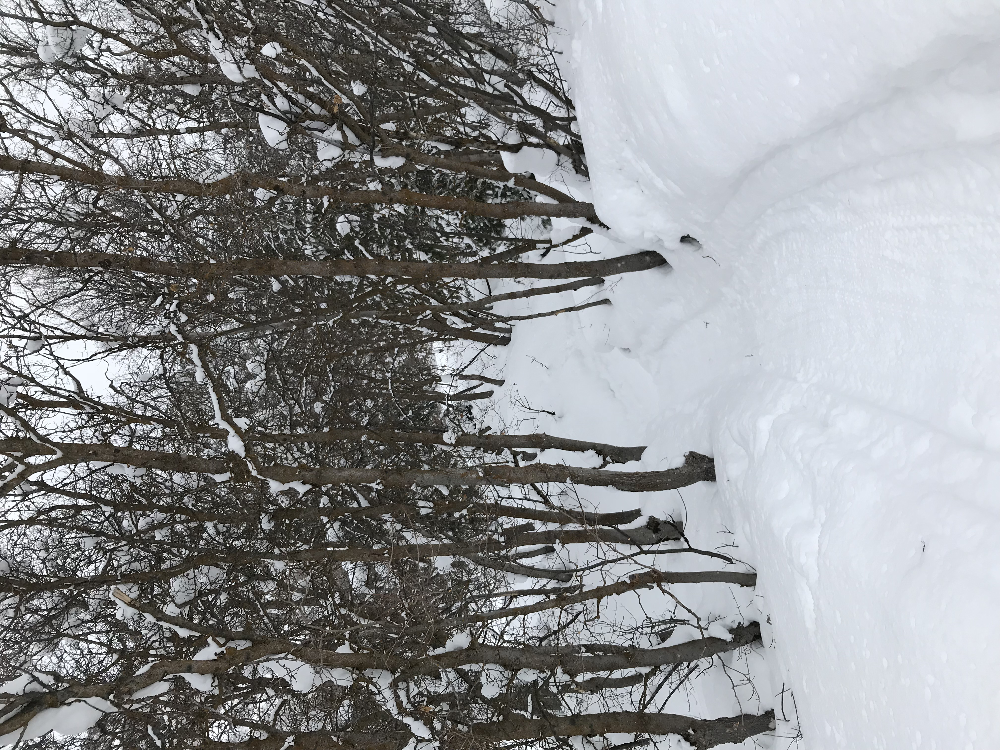
    
The trees

  

  

    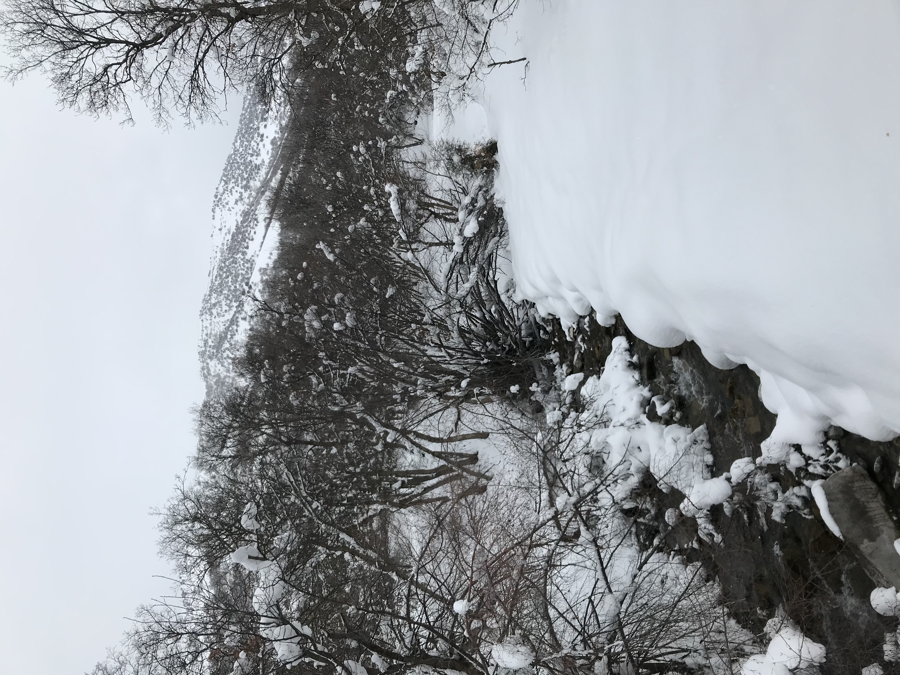
    
The creek

  

  

    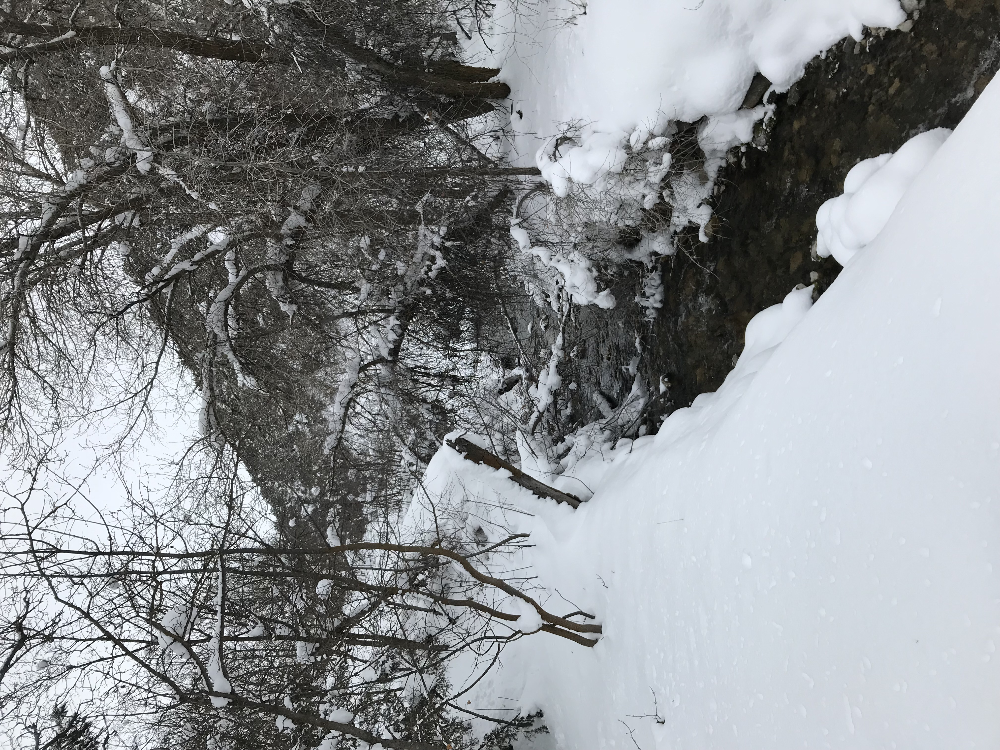
    
More creek

  

