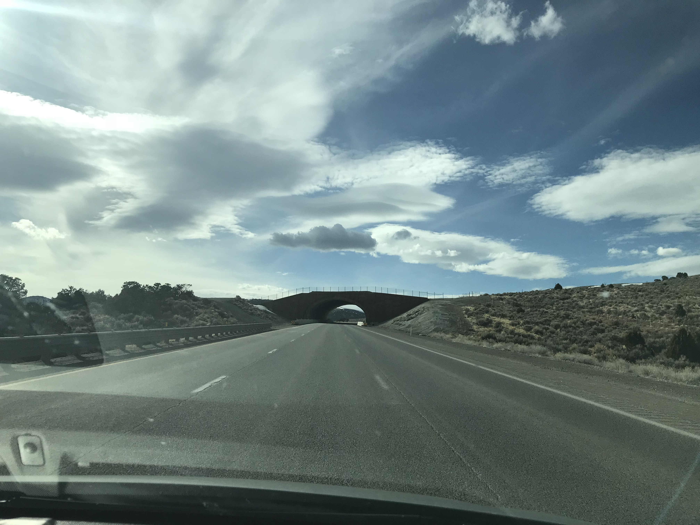
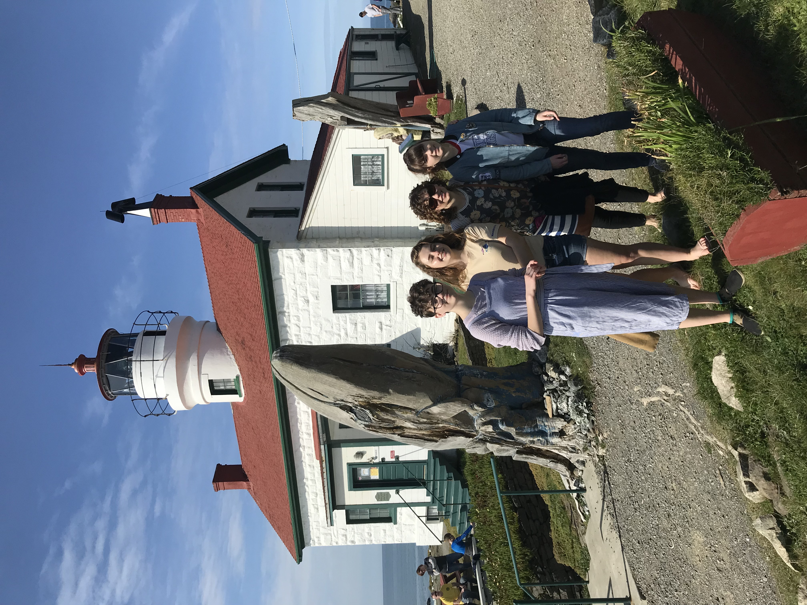

  We took the kids on a 3000 mile road trip through Tahoe, Sonoma Valley and the Redwoods for spring break this year to see trees 50 feet in circumference that are older than most of civilization.

  The food in Northern California left plenty to be desired but our only real regret was missing Dick Taylor chocolate in Eureka California.

  There's quite a bit of distance between Logan, UT and Reno, NV. My wife as always was awesome and drove so that I could work in the car. The mobile wifi in the car worked through most of the trip but even the nicer antennas in the car could connect to the Internet while driving through north eastern Nevada.

  Family vacations tend to blur together. My brain blends all the days into one long event with only vague, sleepless nights to punctuate the days. I'm trying pictures to help deliniate. See below.

  <a href="https://roadtrippers.com">Roadtrippers</a> turned out to be a great way to play out our trip:
  <a id="embed-20752520" href="https://roadtrippers.com/map?a2=t!20752520&lat=40.4532237479857&lng=-124.312426609618&utm_campaign=trip&utm_medium=share&utm_source=embed&z=4.483615945700077">Redwood National Park Trip on Roadtrippers</a> 

<h2>Day 1:</h2>

  

    
    
There wasn't a lot to see, but these new animal bridges in the middle of nowhere were kind of interesting. I'm sure the antelope appreciate not having to play frogger at 90mph.

  

<h2>Day 2:</h2>

  

    
    
Day 2: We wake up in Reno and visit Target. No pictures from there because they are all the same. We found a small road to the Mt Rose ski area that neither the car GPS nor Google maps liked so we took that road. The kids are standing on the roof of the restrooms.

  

  

    
    
Overlooking Lake Tahoe

  

  

    
    
The water at Lake Tahoe is beautiful, but cold this time of year. We'll have to come back to swim.

  

  

    
    
On a business trip years ago I first visited the Railroad museum in old Sacramento. I thought Devin would love it and on this trip we managed a visit. 

  

  

    
    
My daughters love train museums :-). Lucky for them we only had an hour before they closed and kicked us out.

  

  

    
    
They have really cool, really old trains.

  

  

    
    
Old Town Sacramento is a fun place to walk around. All the Teslas help you feel like you are in the old west.

  

  

    
    
We continue our trip through wine country. The vineyards are beautiful.

  

  

    
    
Giant guard duck. Don't mess with these guys.

  

No pictures but we rolled into Santa Rosa really late at night and managed to find a decent Mexican restaraunt still open for dinner.

<h2>Day 3: </h2>

  

    
    
With a roof carrier our van wasn't about to fit but Austin drove through the tree with all our kids.

  

  

    
    
Avenue of the giants. The fallen trees are like skyscrapers laid on their side.

  

  

    
    
Wife and I and a big tree.

  

  

    
    
Big tree with kids.

  

  

    
    
Grove of big trees.

  

  

    
    
No need for bridges where we're going.

  

  

    
    
Exactly what kind of monster chain saw can do this?

  

  

    
    
This is the largest redwood in the world.

  

  

    
    
My beautiful wife and I in front of the largest tree in the world.

  

<h2>Day 4: </h2>

Eureka, California. 

  

    
    
Eureka, California is home of the Carson mansion<.a href="https://en.wikipedia.org/wiki/Carson_Mansion">Carson Mansion</a>

  

  

    
    
Carson wanted to keep his son close so he built him a smaller place across the street as a wedding gift. I think we got a blender for our wedding...

  

  

    
    
<a href="https://www.parks.ca.gov/?page_id=417">Patrick's Point state park</a>. This is a nerve racking place to visit when you have a lot of children who love to climb rocks who don't realize the other side of the next rock is a 100 foot drop to their death.

  

  

    
    
Sunset along the Northern California coast

  

<h2>Day 5: </h2>

Fern Valley.

  

    
    
Fern Valley. Nearly destroy our brand new van and froze my feet off walking through the watter. It was awesome.

  

  

    
    
Aubrey loved it.

  

  

    
    
Callie and Jenna

  

  

    
    
Brennan scales a giant log

  

  

    
    
Bannana slugs are cool

  

  

    
    
Giant logs mean a different kind of trail maintanence.

  

<h2>Day 6: </h2>

Crescent City, CA

  

    
    
Battery Point lighthouse in Crescent City, CA

  

  

    
    
 Fallen redwood at Stout Grove. 

  

  

    
    
Bluebird at Stout Grove

  

  

    
    
Beaches along highway 1

  

  

    
    
Cool water arch along highway 1

  

  

    
    
Another cool beach on our way to Coos Bay

  

  

    
    
Battle Rock Park - Port Orford, Oregon. It was cold, but Jenna can't resist the ocean.

  

<h2>Day 5: </h2>

Coos Bay.

  

    
    
Devin at Gardens at Shore Acres State Park

  

  

    
    
The tulips were in bloom

  

  

    
    
And it was pretty rainy

  

  

    
    
The waves that break here can reach to the observation point.

  

  

    
    
On the way up to Crater Lake.

  

  

    
    
That's Crater Lake. Devin really wanted to see it, but it's covered in clouds a good part of the year.

  

  

    
    
Snow

  

  

    
    
Callie in the snow

  

  

    
    
There was so much snow

  

<h2>Day 6: </h2>

Bend, Oregon. We didn't really calculate how long of a drive it would be from Crater Lake to Bend. It was long. 

  

    
    
Devin's birthday is pretty much always during spring break so we usually celebrate in a hotel room somewhere.

  

  

    
    
Otter's at the High Desert Museum

  

  

    
    
Devin

  

  

    
    
Devin in outhouse

  

  

    
    
The Oregon desert on the way to Boise.

  

<h2>Day 7: </h2>

Boise, ID. During our trip my mom called to let me know that my Uncle Rich had passed away. We had intended to visit my parents in Idaho anyway, but in order to make the funeral we had to get up early and drive like crazy people to get to Roberts.

  

    
    
My Uncle Rich's funeral.

  

<h2>Day 7: </h2>

  

    
    
Last day or our trip. We usually celebrate Easter in Idaho with my family. Our intention was to celebrate a week late. Here's an "Easter" picture of the kids.

  

